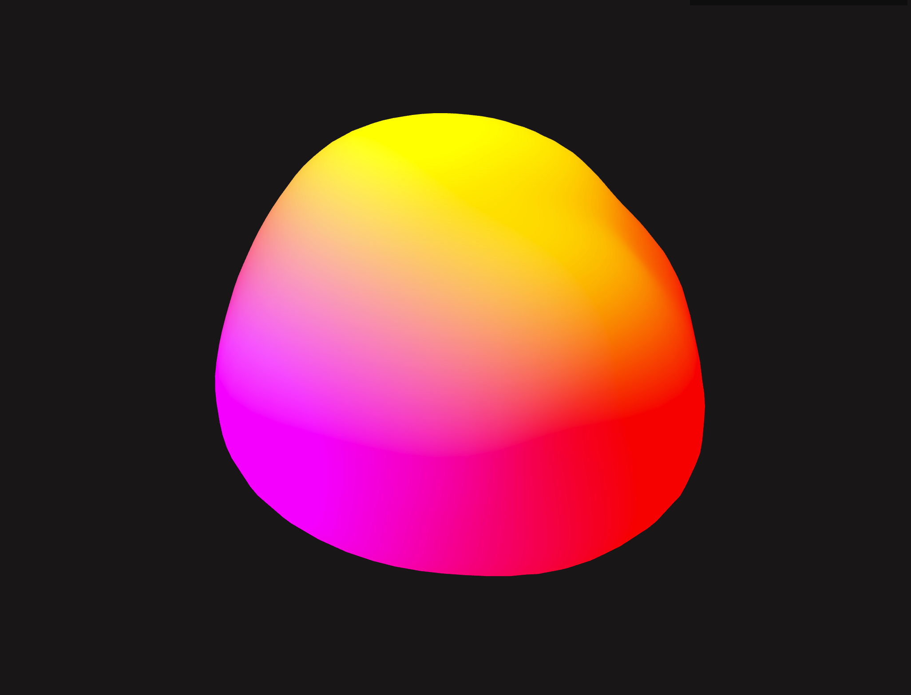

# Organic Sphere

Made to practice WebGL Shaders.

Thanks to Stefan Gustavson for the perling noise algorithm. 

- v1: 

## Setup

- <code>npm install</code> 
- <code>npm run dev</code>
- Then, go to <a href="http://localhost:5173">localhost:5173</a>
